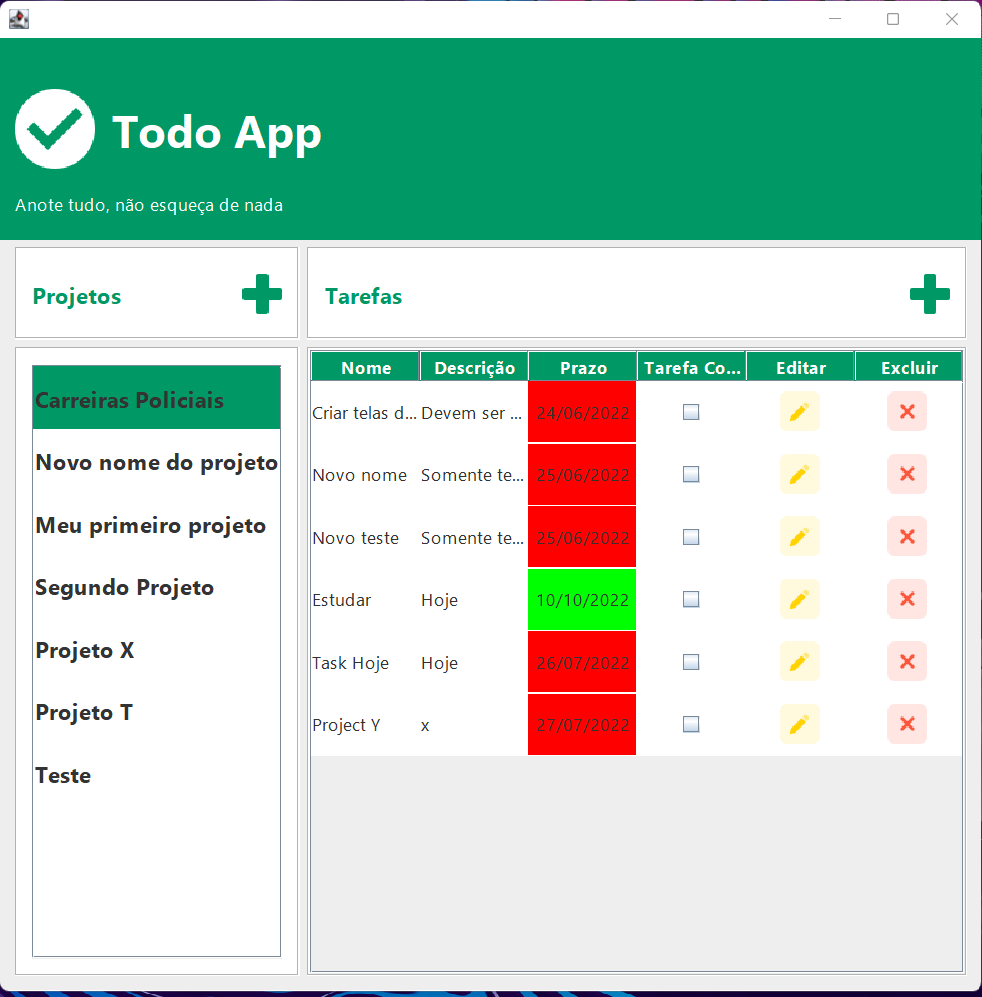
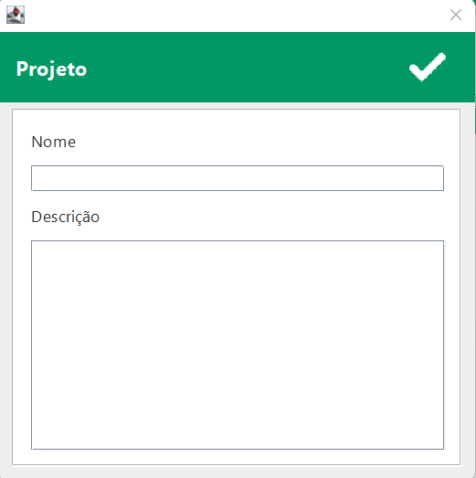
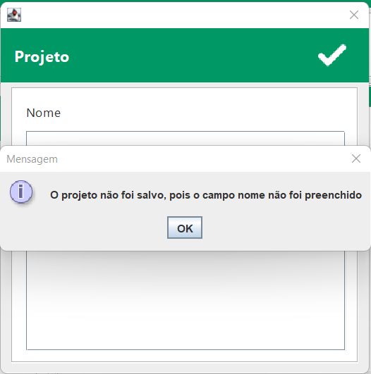
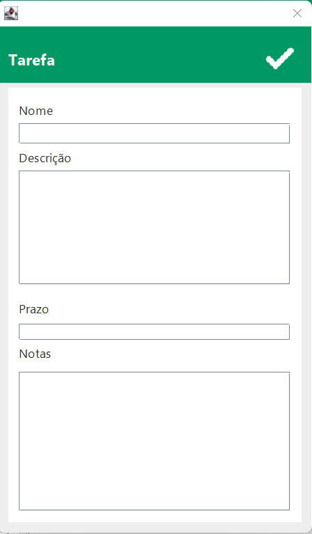
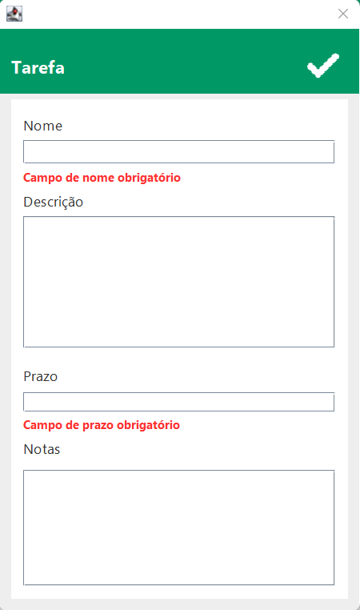

  

<h1 align="center">Todo App</h1>

<h2>🎯 Objetivo do Projeto</h2>

 Resolver a questão de organização de tarefas de um ou vários projetos..

<h2>🛠 Tecnologias Utilizadas</h2>

<ul>
    <li>Apache NetBeans</li>
    <li>Java</li>
    <li>Interface Gráfica - Swing</li>
    <li>MySQL Workbench</li>
    <li>MVC (Model View Controller)</li>
    <li>DAO</li>
</ul>

<h2>💻 Imagens do Sistema </h2>

<h3> ✅ Página Principal </h3>

  

<h3> ✅ Cadastro de Projetos </h3>

  

<h3> ✅ Validação do Cadastro de Projetos </h3>

  

<h3> ✅ Cadastro de Projetos Tarefas </h3>

  

<h3> ✅ Validação do Cadastro de Tarefas </h3>

  

